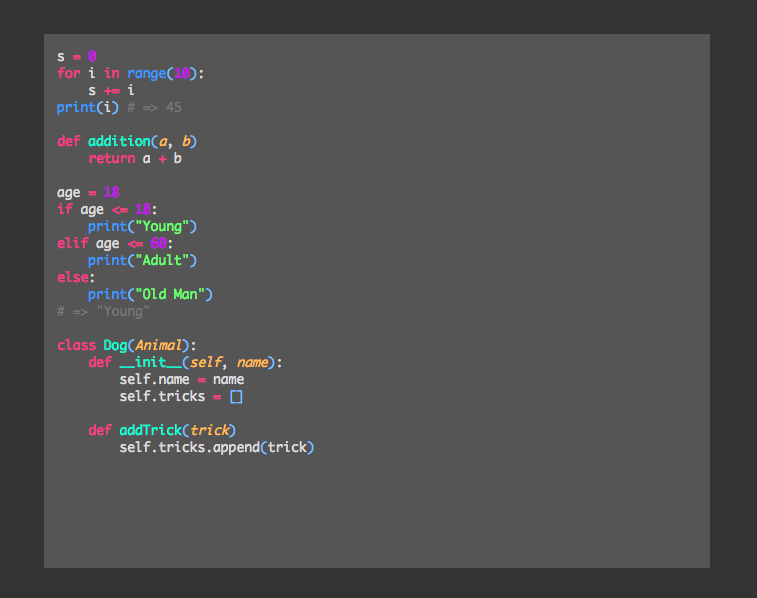

# LeichterJS

## Simple Code Highlighting Tool Named by Lighter in German

### Installation

Using Yarn:

```
  $ yarn add leichter
```

### Status

Currently only support *most* of the general Python syntax highlighting

### Usage

Checkout the samples [here](https://github.com/Maxwell-Alexius/LeichterJS/tree/master/sample)!

Assume you have a simple python code in a `pre` tag, which is shown below:

```html
    <pre id="python-code">
s = 0
for i in range(10):
    s += i
print(i) # => 45

def addition(a, b)
    return a + b

age = 18
if age <= 18:
    print("Young")
elif age <= 60:
    print("Adult")
else:
    print("Old Man")
# => "Young"

class Dog(Animal):
    def __init__(self, name):
        self.name = name
        self.tricks = []
    
    def addTrick(trick)
        self.tricks.append(trick)</pre>
```

In JavaScript, specify the language you wanted to highlight and the ID of the element to highlight the code:

```js
  var lighter = new Leichter({
    lang: 'python',
    element: 'python-code'
  })
```

And then ignite it!

```js
  lighter.ignite(); // Or you can use lighter.entzünden() which is the alias method of the ignite method
```

There you go:

